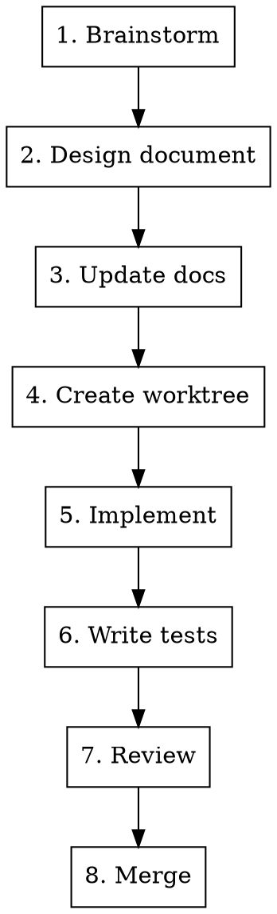

# Feature Development

Process for implementing a new feature in this project.

## Prerequisites

Before starting, read:
- [docs/architecture.md](docs/architecture.md) — layer structure
- [docs/features.md](docs/features.md) — existing features list
- [docs/testing.md](docs/testing.md) — testing strategy

## Process



### 1. Brainstorm

Use `superpowers:brainstorming` skill to clarify requirements:
- What problem does this solve?
- What are the inputs/outputs?
- What are edge cases?
- Which layers are affected?

### 2. Design Document

Write design to `docs/plans/YYYY-MM-DD-<topic>-design.md`:
- Architecture changes
- Data flow
- API/interface design
- Error handling
- Testing approach

### 3. Update Documentation

**Mandatory updates:**

| Document | When to update |
|----------|----------------|
| `docs/features.md` | Always — add feature description with ID |
| `docs/architecture.md` | If architecture changes |

Feature ID format: `kebab-case` (e.g., `session-finalize`, `payment-mark-paid`)

### 4. Create Worktree

Use `superpowers:using-git-worktrees` to create isolated workspace:

```bash
cd .worktrees/my-feature
../../scripts/setup-worktree.sh
```

### 5. Implement

Follow layer structure from [architecture.md](docs/architecture.md):

| Layer | What to implement |
|-------|-------------------|
| `services/entities/` | Database operations, domain logic |
| `services/formatters/` | Message formatting (text + buttons) |
| `services/transport/telegram/` | Input parsing, output calls |
| `business/` | Coordination logic |

### 6. Write Tests

Follow [testing.md](docs/testing.md):

| Layer | Test type | What to mock |
|-------|-----------|--------------|
| services/entities | Unit + DB | — |
| services/formatters | Unit | — |
| services/transport | Unit | grammy API |
| business | Unit | All services |
| Feature | Integration | — (full path) |

**Integration test:** `tests/integration/specs/<feature-id>.test.ts`
- Check only bot response, not database

### 7. Review

Before merge:
```bash
npm run typecheck && npm run lint && npm test
```

Use `superpowers:verification-before-completion` to verify.

### 8. Merge

Use `superpowers:finishing-a-development-branch` to complete.

## Checklist

- [ ] Brainstorm complete, requirements clear
- [ ] Design document written
- [ ] Feature added to `docs/features.md`
- [ ] `docs/architecture.md` updated (if needed)
- [ ] Implementation follows layer structure
- [ ] Unit tests for each layer
- [ ] Integration test for feature
- [ ] `npm run typecheck && npm run lint && npm test` passes